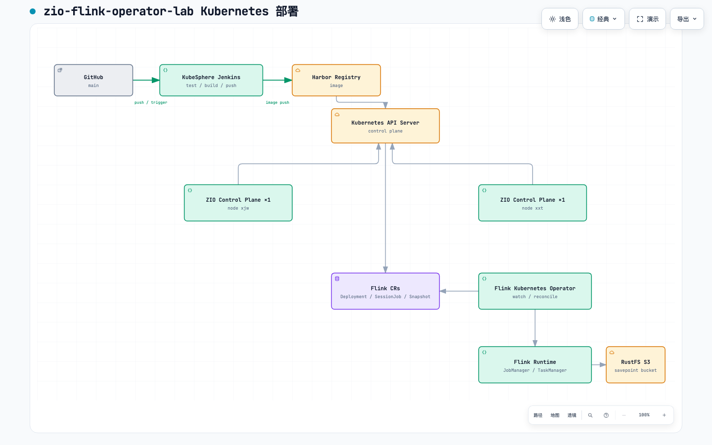
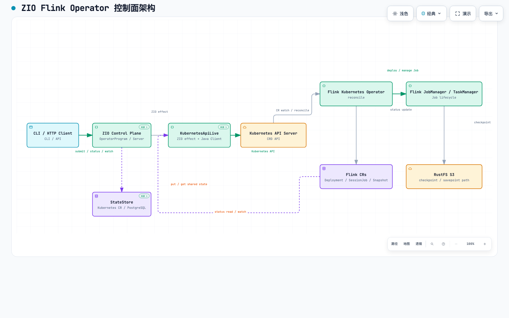
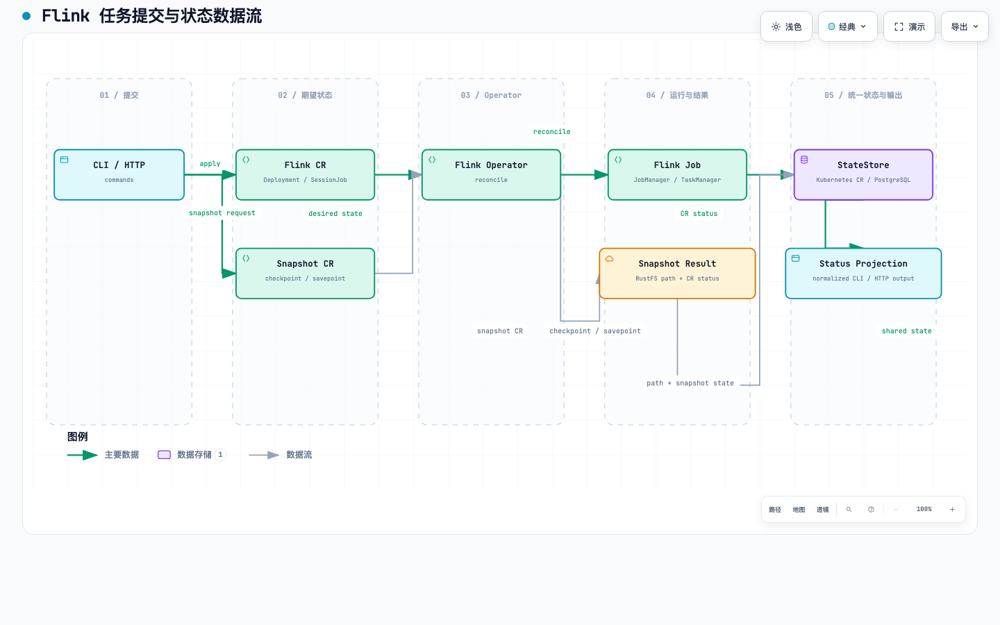

# ZIO Flink Operator Control Plane

这是一个 Scala 3 + ZIO 控制面：通过 Kubernetes API 调用 Flink Kubernetes Operator，提交 `FlinkDeployment`、`FlinkSessionJob` 和 `FlinkStateSnapshot`，并观察任务、checkpoint、savepoint 与 Operator 状态。项目北极星是：**类型化、可审计、可验证结果的 Flink 操作控制面**。

程序不调用 `kubectl`，不直接操作 JobManager。Kubernetes CR 是期望状态和状态来源，Flink Kubernetes Operator 负责实际 reconcile。

从 [文档入口](docs/README.md) 开始。

## 架构与数据流

核心链路是：`CLI/HTTP → ZIO 控制面 → Kubernetes API → Flink Kubernetes Operator → Flink CR/Flink 作业`。

- 部署拓扑截图：

  

- 控制面架构截图：

  

- 状态与数据流截图：

  

- [交互式架构图](docs/diagrams/architecture.html)：组件边界、职责和部署关系。
- [交互式 Kubernetes 部署图](docs/diagrams/deployment.html)：GitHub、Jenkins、Registry、两节点和 Flink 运行时。
- [交互式数据流图](docs/diagrams/dataflow.html)：提交、状态观察、快照和 RustFS 存储链路。
- [设计与协议](docs/design.md)：Kubernetes API-only 约束、资源模型和状态语义。
- [设计与协议](docs/design.md)：类型化操作、ResourceObserver、VerificationEngine、worker 和共享操作存储。

## 最短流程

```sh
export JAVA_HOME=$(/usr/libexec/java_home -v 17)
export FLINK_NAMESPACE=flink-lineage-test

sbt -batch test
sbt "run render deployment --name orders --namespace $FLINK_NAMESPACE"
sbt "run apply deployment --name orders --namespace $FLINK_NAMESPACE --dry-run"
sbt "run apply deployment --name orders --namespace $FLINK_NAMESPACE"
sbt "run watch deployment --name orders --namespace $FLINK_NAMESPACE"
```

项目自带的示例 Job：

```sh
mvn -B -f job/pom.xml package -DskipTests
```

JAR 必须位于 Flink Pod 可访问的位置，再通过 `--jar-uri` 和 `--entry-class` 提交。

## 快照与监控

使用 `FlinkStateSnapshot` 请求 checkpoint 或 savepoint：

```sh
sbt "run apply state-snapshot --name orders-savepoint --target-kind deployment --target-name orders --snapshot-type savepoint --namespace $FLINK_NAMESPACE"
sbt "run watch state-snapshot --name orders-savepoint --namespace $FLINK_NAMESPACE"
```

HTTP 控制面由 `sbt "run serve"` 启动，默认监听 `0.0.0.0:8080`。写请求返回 `202` 和 `operationId`，状态通过 `GET /v1/operations/<operationId>` 查询；部署状态、快照创建、列表、查询和删除接口仍保留。Kubernetes 部署是一个 Service 加一个两副本 Deployment；每个副本定时从同一 namespace 的 Kubernetes API 读取 CR 状态，因此请求可以落到任一副本。

状态轮询间隔由 `ZIO_FLINK_STATE_POLL_INTERVAL_SECONDS` 控制，默认 15 秒。Kubernetes 模式以 CR 为事实源；PostgreSQL 模式会把轮询得到的状态和最多 100 条生命周期事件写入共享表。

## 性能评估

当前版本适合低到中等频率的 Flink 控制作业：HTTP 服务默认 8 个阻塞请求线程；每个副本每 15 秒对三类 CR 各发起一次 list，两个副本约为每秒 0.4 次 list 请求。提交和状态查询的实际吞吐取决于 Kubernetes API 延迟、CR 数量和 Operator reconcile 时间，仓库没有把估算当成压测结果。

需要更高吞吐时，优先增加连接复用、把轮询改成共享 watch/leader election，再引入 PostgreSQL 连接池。当前实现的高可用证据是两副本跨节点运行和同一 CR 状态，不是已经完成的高并发压测。

目标集群的小样本现场测量（NodePort、每个节点独立请求）为：`/healthz` 20 次平均约 13.6–18.2 ms，`/v1/state` 10 次平均约 96–147.5 ms，后者 P95 约 268.5–301.7 ms。该测量包含网络和 Kubernetes API 延迟，样本量很小，只用于容量基线，不能替代并发压测。

Kubernetes 部署默认使用 Flink CR 作为统一状态源；裸机部署可将最新状态观测写入 PostgreSQL：

```sh
export ZIO_FLINK_STATE_BACKEND=postgres
export POSTGRES_HOST=100.82.226.63
export POSTGRES_PORT=30660
export POSTGRES_DB=xxt
export POSTGRES_USER=root
export POSTGRES_PASSWORD='由 Secret 注入'
sbt "run serve"
```

状态字段、operation lifecycle、HTTP 示例、统一状态接口和 checkpoint/savepoint 边界见 [状态监控](docs/monitoring.md)。

## 版本与边界

项目使用 Scala 3.3.5、ZIO 2.1.11、ZIO Streams 2.1.11、Kubernetes Java Client 20.0.1，建议 JDK 17。

当前服务读取 Operator CR 的状态摘要。逐个 checkpoint 的 task/subtask 明细需要 Flink REST，当前不属于 Kubernetes API 适配器。真实 Operator reconcile、checkpoint、savepoint 和恢复结果必须在目标集群单独验证；本地单测和 dry-run 不代表这些结果已经完成。

构建、Kubernetes/RustFS 配置和本地多副本部署见 [部署](docs/deployment.md)；验证记录见 [测试与证据](docs/testing.md)。
